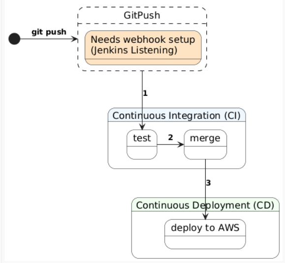

## CI/CD
Automating the process.
## CI = Continues Integreation
Continuous Integration (CI) is the practice of automatically integrating code changes from multiple developers into a shared repository.

Every time a developer pushes code:

* The system builds the application
* Runs automated tests
* Checks for errors before merging

## Benefits of CI
* Early detection of bugs
* Reduces integration issues
* Improves code quality
* Faster development cycles
* Encourages collaboration between developers
## CD = Continues Delivery/Deployment
Continuous Delivery (CD) ensures that code is always in a deployable state after passing CI.

There are two meanings of CD:

1. Continuous Delivery
Code is automatically prepared for release
Deployment requires manual approval
2. Continuous Deployment
Code is automatically deployed to production with no human intervention

## Jenkins 
Jenkins is an open-source automation server used to build, test, and deploy applications.
* automate software
* open-source
* works using jobs
* supports various VC tools

### why jenkins?
open - source
customisation ---> plugins
scalibiity ---> node/agent arcitecture
crossplatform ---> different OS supported

## Benefits
* Automates repetitive tasks
* Huge plugin ecosystem
* Open-source (free)
* Integrates with GitHub, AWS, Docker, etc.
* Supports pipelines (CI/CD workflows)
* Improves efficiency and reliability

## Disadvantages
* Can be complex to set up
* Requires maintenance
* UI is outdated compared to modern tools
* Plugin compatibility issues
* Can become slow if not managed well

### stages of jenkins:
1. scm: Code pushed to GitHub
2. build: Compile/build the application
3. test: Run automated tests
4. package: Merge into main branch (if successful)
5. deliver/deploy: Deploy to environment (e.g. AWS)
6. monitor

## Diagram for CI/CD Pipeline

## Explantion of the CI/CD Pipeline diagram
1. The Trigger: Git Push & Webhook
   * The process starts outside the pipeline with a git push.
   * The Webhook: This acts as a notification system. When code is pushed to a repository (e.g. GitHub), the webhook alerts Jenkins that new code is available.
   * This is the entry point of the pipeline—without it, Jenkins would not know when to start.
2. Continuous Integration (CI)

The middle section represents the CI phase, which focuses on ensuring code quality and stability.

   1. Build: Jenkins first builds the application and creates an executable artifact (e.g. a deployable file).
   2. Test: The pipeline then runs automated unit and integration tests to check that the new code works correctly and hasn’t broken existing functionality.
   3. Merge: If all tests pass, the code is merged into the main branch. At this point, the code is considered stable and ready for deployment.

3. Continuous Deployment (CD)

The final section represents the CD phase, which focuses on releasing the application.

   1. Deploy to AWS: Jenkins takes the tested and merged code (artifact) and deploys it to AWS. This process can be automated, meaning the application is updated without manual effort.
   2. Application Live: Once deployed, the new version of the application is running and accessible to users.SSH push test
## Jenkins
[Jenkins CI/CD Pipeline](jenkins-cicd-pipeline.md)
