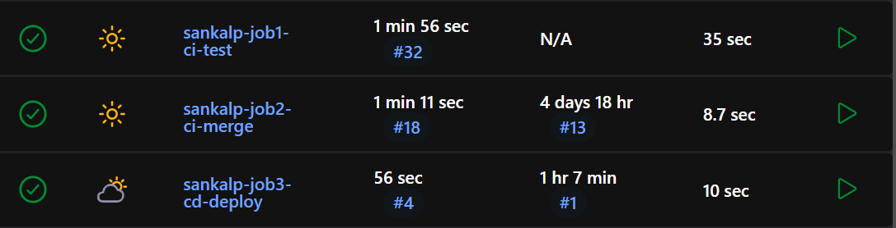
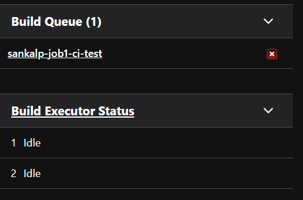
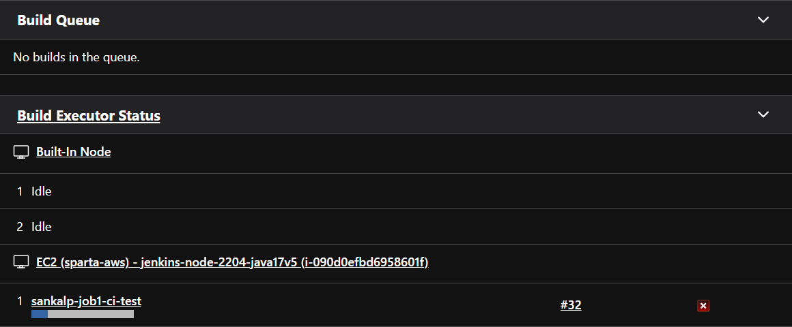
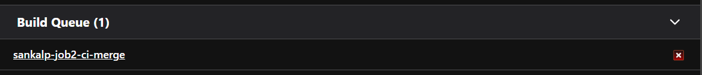
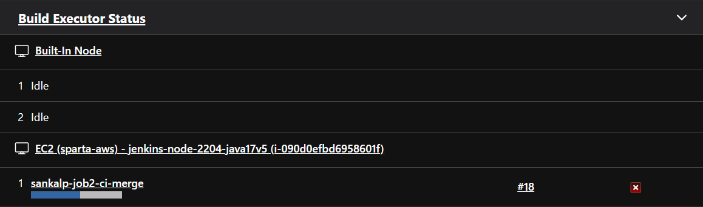
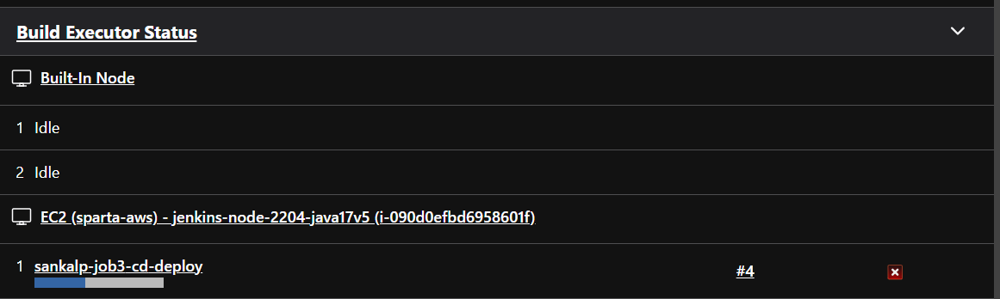
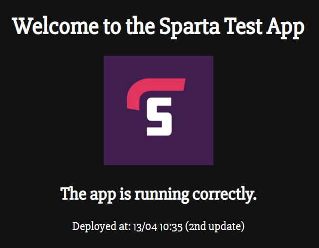

## Jenkins CI/CD pipeline
- [Jenkins CI/CD pipeline](#jenkins-cicd-pipeline)
- [Job 1:](#job-1)
  - [Step 1: Create a New Jenkins Job](#step-1-create-a-new-jenkins-job)
  - [Step 2: Configure Source Code (GitHub Repo)](#step-2-configure-source-code-github-repo)
  - [Step 3: Understand Default Working Directory](#step-3-understand-default-working-directory)
  - [Step 4: Add Build Step (Execute Shell)](#step-4-add-build-step-execute-shell)
  - [Step 7: Save the Job](#step-7-save-the-job)
  - [Step 8: Run the Job](#step-8-run-the-job)
  - [Step 9: Observe Build Queue \& Execution](#step-9-observe-build-queue--execution)
  - [Step 10: Check Console Output](#step-10-check-console-output)
- [Blockers](#blockers)
  - [Blocker 1: Missing models Folder](#blocker-1-missing-models-folder)
  - [Blocker 2: Missing app.js](#blocker-2-missing-appjs)
  - [Blocker 3: SSH Authentication Failure](#blocker-3-ssh-authentication-failure)
  - [Final Outcome](#final-outcome)
- [Webhook Setup (Triggering the Pipeline)](#webhook-setup-triggering-the-pipeline)
  - [Step 1: Configure Webhook in GitHub](#step-1-configure-webhook-in-github)
  - [Step 2: Configure Jenkins Job 1](#step-2-configure-jenkins-job-1)
  - [Outcome](#outcome)
- [Job 2: CI Merge (dev → main)](#job-2-ci-merge-dev--main)
  - [Purpose](#purpose)
  - [Step 1: Create and Switch to dev Branch](#step-1-create-and-switch-to-dev-branch)
  - [Step 2: Switch to dev Branch](#step-2-switch-to-dev-branch)
  - [Step 3: Make a Change](#step-3-make-a-change)
  - [Step 4: Check Status](#step-4-check-status)
  - [Step 5: Stage and Commit](#step-5-stage-and-commit)
  - [Step 6: Push dev Branch](#step-6-push-dev-branch)
- [Job 2](#job-2)
  - [Step 1: Create a New Jenkins Job](#step-1-create-a-new-jenkins-job-1)
  - [Step 2: Configure Source Code (GitHub Repo)](#step-2-configure-source-code-github-repo-1)
  - [Step 3: Configure Job Trigger (Link Job 1 → Job 2)](#step-3-configure-job-trigger-link-job-1--job-2)
  - [Step 4: Add Build Step (Merge dev into main)](#step-4-add-build-step-merge-dev-into-main)
  - [Step 5: Save and Run Pipeline](#step-5-save-and-run-pipeline)
  - [Blocker: SSH Authentication Failure in Job 2](#blocker-ssh-authentication-failure-in-job-2)
- [Job 3: CD Deployment to EC2 (Step-by-Step)](#job-3-cd-deployment-to-ec2-step-by-step)
  - [Purpose](#purpose-1)
  - [Step 1: Create AWS EC2 Instance](#step-1-create-aws-ec2-instance)
  - [Step 2: Prepare EC2 Environment](#step-2-prepare-ec2-environment)
  - [Step 3: Create Jenkins Credentials for EC2](#step-3-create-jenkins-credentials-for-ec2)
  - [Step 4: Create Job 3 (CD Deploy Job)](#step-4-create-job-3-cd-deploy-job)
  - [Step 5: Configure Source Code](#step-5-configure-source-code)
  - [Step 6: Link Job 2 → Job 3](#step-6-link-job-2--job-3)
  - [Step 7: Configure Build Environment](#step-7-configure-build-environment)
  - [Step 8: Add Deployment Script (Build Step)](#step-8-add-deployment-script-build-step)
  - [Step 9: Run Full Pipeline Test](#step-9-run-full-pipeline-test)
  - [Step 10: Observe Pipeline Flow](#step-10-observe-pipeline-flow)
  - [Step 11: Console Output](#step-11-console-output)
  - [Step 12: Verify Deployment](#step-12-verify-deployment)
- [Blockers](#blockers-1)
  - [Blocker 1: Git Authentication Failure (SSH Key Issue)](#blocker-1-git-authentication-failure-ssh-key-issue)
  - [Issue](#issue)
  - [Cause](#cause)
  - [Resolution](#resolution)
  - [Blocker 2: Missing Project Files in Jenkins Build (Job 1 Failure)](#blocker-2-missing-project-files-in-jenkins-build-job-1-failure)
  - [Issue](#issue-1)
  - [Cause](#cause-1)
  - [Resolution](#resolution-1)
  - [Outcome](#outcome-1)
  - [Blocker 3 (Major Reset Issue): Pipeline Restarted From Scratch](#blocker-3-major-reset-issue-pipeline-restarted-from-scratch)
  - [Issue](#issue-2)
  - [Cause](#cause-2)
  - [Resolution](#resolution-2)
  - [Outcome](#outcome-2)


## Job 1:

### Step 1: Create a New Jenkins Job
1. Open your Jenkins dashboard
2. Click “New Item”
3. Enter a name (e.g. job1-ci-test)
4. Select Freestyle Project
5. Click OK

### Step 2: Configure Source Code (GitHub Repo)
1. Scroll to Source Code Management (SCM)
2. Select Git
3. Paste your GitHub repository URL
4. Add credentials if required (SSH key)

At this point, Jenkins is set to: Clone your repository automatically when the job runs

### Step 3: Understand Default Working Directory
1. Jenkins starts inside the root of the cloned repo
2. Your application is inside an app folder: So you must manually navigate into it during the build step

### Step 4: Add Build Step (Execute Shell)
1. Scroll to Build
2. Click Add Build Step
3. Select Execute Shell
4. Step 5: Add Commands to Run Unit Tests
```bash
cd tech601-sparta-test-app-cicd/app
npm install
npm test
```
### Step 7: Save the Job
1. Click Save

### Step 8: Run the Job
1. Go back to Dashboard
2. Click your job
3. Click Build Now

### Step 9: Observe Build Queue & Execution
1. Job enters the Build Queue
2. Jenkins assigns it to an agent node
3. Status changes from:
    Queued → Running

### Step 10: Check Console Output
1. Click the build number (e.g. #1)
2. Click Console Output

You will see:
```bash
Git clone process
cd app execution
npm install logs
npm test results
```
---
## Blockers
During the setup and execution of the CI/CD pipeline using Jenkins, I encountered several issues. I investigated and resolved them as follows:

---

### Blocker 1: Missing models Folder

**Issue:**
Error: Cannot find module '../models/post'

**Cause:**
- The models/ directory was not copied into the CI/CD repository  
- The seed.js script (run during npm install) depends on this folder  

**Resolution:**
```bash
cp -r /c/Users/sanka/tech601-sparta-app/app/models app/
git add .
git commit -m "Fix Jenkins build - add missing models folder"
git push
```
### Blocker 2: Missing app.js

**Issue:**
Error: Cannot find module '../app'

**Cause:**

- The main application file app.js was missing from the repository
- The test suite (test-server.js) requires this file

**Resolution:**
```bash
cp /c/Users/sanka/tech601-sparta-app/app/app.js app/
git add .
git commit -m "Fix Jenkins build - add missing app.js"
git push
```

**Outcome:**
Tests were able to locate and run the application correctly.

### Blocker 3: SSH Authentication Failure

**Issue:**
git@github.com
: Permission denied (publickey)

**Cause:**

SSH agent was not running or the key was not loaded

**Resolution:**
```bash
eval `ssh-agent -s`
ssh-add ~/.ssh/tech601-sankalp-github-key
ssh -T git@github.com
git push
```

**Outcome:**
```bash
Successful authentication and ability to push changes to GitHub.
```

### Final Outcome

After resolving the above blockers:
```bash
Jenkins successfully cloned the repository via SSH
Dependencies installed correctly
Tests executed successfully
Build completed with status: SUCCESS
```

---


## Webhook Setup (Triggering the Pipeline)

### Step 1: Configure Webhook in GitHub
1. Go to your GitHub repository  
2. Click **Settings → Webhooks**  
3. Click **Add Webhook**  

Fill in the following:
- Payload URL:  
  http://<jenkins-ip>:8080/github-webhook/
- Content type: application/json  
- Events: Just the push event  

Click **Add Webhook**

---

### Step 2: Configure Jenkins Job 1
1. Open Job 1 in Jenkins  
2. Go to **Build Triggers**  
3. Enable:
   - GitHub hook trigger for GITScm polling  

---

### Outcome
- Every time I run `git push`, Jenkins is automatically triggered  
- Job 1 runs without needing manual input  
- This forms the start of the CI pipeline

---

## Job 2: CI Merge (dev → main)

### Purpose
The purpose of Job 2 is to automatically merge code from the `dev` branch into the `main` branch after Job 1 (testing) is successful.

This ensures that only tested code is merged into the main branch.

---

### Step 1: Create and Switch to dev Branch

I created a new branch called `dev` to simulate a developer making changes:

```bash
git branch dev
git branch
```

**Output:**
```bash
dev
main
```
### Step 2: Switch to dev Branch
`git switch dev`

**Output:**
Switched to branch `dev`

**To confirm:**
`git branch`

**Output:**
```bash
dev
main
```

### Step 3: Make a Change

I edited a file (README.md) to simulate a code change:
```bash
nano README.md
```

### Step 4: Check Status
`git status`

**This showed:**
`README.md was modified`

### Step 5: Stage and Commit
```bash
git add .
git commit -m "doc: change heading"
```
### Step 6: Push dev Branch

**First attempt:**
```bash
git push
```
Error:
```bash
No upstream branch set
```
Fix:
```bash
git push --set-upstream origin dev
```
Outcome of Git Steps
```bash
dev branch successfully pushed to GitHub
```
Ready to trigger the CI pipeline using webhook

---
## Job 2
### Step 1: Create a New Jenkins Job
1. Go to Jenkins dashboard
2. Click New Item
3. Enter name: sankalp-job2-ci-merge
4. Select Freestyle Project
5. Click OK

### Step 2: Configure Source Code (GitHub Repo)
1. Scroll to Source Code Management (SCM)
2. Select Git
3. Enter repository URL:`git@github.com:sankalpdevopstrain/tech601-sankalp-sparta-app-cicd.git`
4. Add credentials:
   - Kind: SSH Username with private key
   - Username: git
   - Private key: Content of `tech601-job2-jenkins-key`
5. Branch to build:`*/dev`

### Step 3: Configure Job Trigger (Link Job 1 → Job 2)

1. In Job 1 (sankalp-job1-ci-test):
   1.  Go to Post-build Actions
   2.  Select: Build other projects
   3.  Enter: sankalp-job2-ci-merge

This ensures:
- Job 2 only runs if Job 1 is SUCCESS

### Step 4: Add Build Step (Merge dev into main)
1. Scroll to Build → Execute Shell
- Add: Set Git author for merge commit
  - git config user.name "Sankalp Hiregoudar"
  - git config user.email "sankalpdevopstrain@gmail.com"

2. Fetch latest branches
```bash
git fetch origin
```
3. Ensure main is up-to-date locally
```bash
git checkout main
git reset --hard origin/main
```

4. Merge dev into main
```bash
git merge origin/dev
```

6. Push main back to GitHub
```bash
git push origin main
```

### Step 5: Save and Run Pipeline
1. Make a change in dev branch
2. Run:
```bash
git add .
git commit -m "test job2 pipeline"
git push origin dev
```

**Final Outcome**
- Webhook triggers Job 1
- Job 1 runs tests
- If tests pass → Job 2 runs automatically
- Code is merged from dev → main

This creates a basic CI pipeline with automated merging.

### Blocker: SSH Authentication Failure in Job 2
**Issue**
```bash
git@github.com: Permission denied (publickey).
fatal: Could not read from remote repository.
```
**Cause**
- Jenkins Job 2 was using an SSH key that did not have write access to the GitHub repository
- GitHub rejected the connection during:
```bash
git fetch origin
git push origin main
```

---
## Job 3: CD Deployment to EC2 (Step-by-Step)
### Purpose

The purpose of Job 3 is to automatically deploy the tested and merged application from GitHub to an AWS EC2 instance. This ensures that any approved code changes are deployed to a live server without manual work.

### Step 1: Create AWS EC2 Instance
1. Go to AWS EC2 Dashboard
2. Click Launch Instance
3. Configure:
   1. Name: `tech601-sankalp-jenkins-app`
   2. AMI: `Ubuntu Server 22.04 LTS`
   3. Instance type: `t3.micro`
   4. Key pair: `tech601-sankalp-aws`
4. Configure Security Group:
   1. `SSH (22)` → My IP / Anywhere (for testing)
   2. `HTTP (80)` → Anywhere
   3. `Custom TCP (3000)` → Anywhere (Node app access)
5. Click Launch Instance

### Step 2: Prepare EC2 Environment
1. Connect to EC2 using SSH:
```bash
ssh -i tech601-sankalp-aws.pem ubuntu@54.171.170.159
```
2. Install required dependencies:
```bash
sudo apt update
sudo apt install nodejs npm -y
npm install -g pm2
```
3. Create application directory:
```bash
mkdir -p ~/app
```
### Step 3: Create Jenkins Credentials for EC2
1. Go to Jenkins → Manage Credentials
2. Add new credential:
   1. Kind: SSH Username with private key
   2. ID: sankalp-aws-pem
   3. Username: ubuntu
   4. Private Key: paste EC2 .pem key
3. Save credentials

### Step 4: Create Job 3 (CD Deploy Job)
1. Go to Jenkins → New Item
2. Name: `sankalp-job3-cd-deploy`
3. Select Freestyle Project
4. Click OK

### Step 5: Configure Source Code
1. Under Source Code Management
2. Select Git
3. Add repository:`git@github.com:sankalpdevopstrain/tech601-sankalp-sparta-app-cicd.git`
4. Branch: `*/main`
5. Credentials:
   1. Use GitHub SSH key: `sankalp-jenkins-2-github-key`

### Step 6: Link Job 2 → Job 3
1. Open Job 2
2. Go to Post-build Actions
3. Select: `Build other projects`
4. Add: `sankalp-job3-cd-deploy`

### Step 7: Configure Build Environment
1. Enable:
   1. SSH Agent
   2. Select credentials: `sankalp-aws-pem`

### Step 8: Add Deployment Script (Build Step)

1. Add Execute Shell:
```bash
ssh -o StrictHostKeyChecking=no ubuntu@52.211.137.86 "rm -rf /home/ubuntu/app"

scp -o StrictHostKeyChecking=no -r tech601-sparta-test-app-cicd/app ubuntu@52.211.137.86:/home/ubuntu/

ssh -o StrictHostKeyChecking=no ubuntu@52.211.137.86 "
cd /home/ubuntu/app
npm install
pm2 delete app || true
pm2 start app.js --name app
"
```
### Step 9: Run Full Pipeline Test
1. Make a change in dev branch
2. Commit and push:
   1. git add .
   2. git commit -m "test Job 3 deployment"
   3. git push origin dev

### Step 10: Observe Pipeline Flow

1. Job 1 runs tests:


2. Job 2 merges dev → main:


3. Job 3 deploys to EC2:


### Step 11: Console Output
1. Go to Jenkins dashboard
2. Click on `sankalp-job3-cd-deploy`
3. In build history:
   1. Click on the last `#` number
   2. Click on `console output`:
      ```bash
      Console Output
      Started by upstream project "sankalp-job2-ci-merge" build number 18
      originally caused by:
      Started by upstream project "sankalp-job1-ci-test" build number 32
      originally caused by:
      Started by GitHub push by sankalpdevopstrain
      Running as SYSTEM
      Building remotely on EC2 (sparta-aws) - jenkins-node-2204-java17v5 (i-090d0efbd6958601f) in workspace /var/jenkins/workspace/sankalp-job3-cd-deploy
      [WS-CLEANUP] Deleting project workspace...
      [WS-CLEANUP] Deferred wipeout is used...
      [ssh-agent] Looking for ssh-agent implementation...
      [ssh-agent]   Exec ssh-agent (binary ssh-agent on a remote machine)
      $ ssh-agent
      SSH_AUTH_SOCK=/tmp/ssh-XXXXXXNaB53p/agent.1245
      SSH_AGENT_PID=1247
      [ssh-agent] Started.
      Running ssh-add (command line suppressed)
      Identity added: /var/jenkins/workspace/sankalp-job3-cd-deploy@tmp/private_key_15985744455087639450.key (/var/jenkins/workspace/sankalp-job3-cd-deploy@tmp/private_key_15985744455087639450.key)
      [ssh-agent] Using credentials ubuntu (EC2 access for Job 3)
      The recommended git tool is: NONE
      using credential sankalp-jenkins-2-github-key
      Cloning the remote Git repository
      Cloning repository git@github.com:sankalpdevopstrain/tech601-sankalp-sparta-app-cicd.git
      > git init /var/jenkins/workspace/sankalp-job3-cd-deploy # timeout=10
      Fetching upstream changes from git@github.com:sankalpdevopstrain/tech601-sankalp-sparta-app-cicd.git
      > git --version # timeout=10
      > git --version # 'git version 2.34.1'
      using GIT_SSH to set credentials to read/write to repo
      > git fetch --tags --force --progress -- git@github.com:sankalpdevopstrain/tech601-sankalp-sparta-app-cicd.git +refs/heads/*:refs/remotes/origin/* # timeout=10
      > git config remote.origin.url git@github.com:sankalpdevopstrain/tech601-sankalp-sparta-app-cicd.git # timeout=10
      > git config --add remote.origin.fetch +refs/heads/*:refs/remotes/origin/* # timeout=10
      Avoid second fetch
      > git rev-parse refs/remotes/origin/main^{commit} # timeout=10
      Checking out Revision 4c01072cd6f08d706712af45788375803485bb23 (refs/remotes/origin/main)
      > git config core.sparsecheckout # timeout=10
      > git checkout -f 4c01072cd6f08d706712af45788375803485bb23 # timeout=10
      Commit message: "Observe Pipeline Flow"
      > git rev-list --no-walk 2e439bb18f0ed76885ce6a7842a2d498a8a0a0e8 # timeout=10
      [sankalp-job3-cd-deploy] $ /bin/sh -xe /tmp/jenkins1004225021445641792.sh
      + ssh -o StrictHostKeyChecking=no ubuntu@52.211.137.86 rm -rf /home/ubuntu/app
      Warning: Permanently added '52.211.137.86' (ED25519) to the list of known hosts.
      + scp -o StrictHostKeyChecking=no -r tech601-sparta-test-app-cicd/app ubuntu@52.211.137.86:/home/ubuntu/
      + ssh -o StrictHostKeyChecking=no ubuntu@52.211.137.86 
      cd /home/ubuntu/app
      npm install
      pm2 delete app || true
      pm2 start app.js --name app


      > sparta-test-app@1.0.1 postinstall
      > node seeds/seed.js

      Database connection closed

      added 388 packages, and audited 389 packages in 5s

      52 packages are looking for funding
      run `npm fund` for details

      21 vulnerabilities (5 low, 5 moderate, 9 high, 2 critical)

      To address all issues, run:
      npm audit fix

      Run `npm audit` for details.
      [PM2] Applying action deleteProcessId on app [app](ids: [ 0 ])
      [PM2] [app](0) ✓
      ┌────┬───────────┬─────────────┬─────────┬─────────┬──────────┬────────┬──────┬───────────┬──────────┬──────────┬──────────┬──────────┐
      │ id │ name      │ namespace   │ version │ mode    │ pid      │ uptime │ ↺    │ status    │ cpu      │ mem      │ user     │ watching │
      └────┴───────────┴─────────────┴─────────┴─────────┴──────────┴────────┴──────┴───────────┴──────────┴──────────┴──────────┴──────────┘
      [PM2] Starting /home/ubuntu/app/app.js in fork_mode (1 instance)
      [PM2] Done.
      ┌────┬────────┬─────────────┬─────────┬─────────┬──────────┬────────┬──────┬───────────┬──────────┬──────────┬──────────┬──────────┐
      │ id │ name   │ namespace   │ version │ mode    │ pid      │ uptime │ ↺    │ status    │ cpu      │ mem      │ user     │ watching │
      ├────┼────────┼─────────────┼─────────┼─────────┼──────────┼────────┼──────┼───────────┼──────────┼──────────┼──────────┼──────────┤
      │ 0  │ app    │ default     │ 1.0.1   │ fork    │ 15692    │ 0s     │ 0    │ online    │ 0%       │ 18.4mb   │ ubuntu   │ disabled │
      └────┴────────┴─────────────┴─────────┴─────────┴──────────┴────────┴──────┴───────────┴──────────┴──────────┴──────────┴──────────┘
      $ ssh-agent -k
      unset SSH_AUTH_SOCK;
      unset SSH_AGENT_PID;
      echo Agent pid 1247 killed;
      [ssh-agent] Stopped.
      Finished: SUCCESS
      ```

### Step 12: Verify Deployment
1. Open browser: http://52.211.137.86:3000
2. Confirm:


---
## Blockers
### Blocker 1: Git Authentication Failure (SSH Key Issue)
### Issue
When attempting to push code to GitHub, authentication failed with the following error:
```bash
Permission denied (publickey)
```
### Cause
* The correct SSH key was not loaded into the SSH agent
* GitHub could not verify the user identity
### Resolution

The SSH agent was restarted and the correct key was added:
```bash
eval "$(ssh-agent -s)"
ssh-add ~/.ssh/sankalp-jenkins-2-github-key
ssh -T git@github.com
Outcome
Successful authentication with GitHub
Able to push and pull code securely using SSH
```

### Blocker 2: Missing Project Files in Jenkins Build (Job 1 Failure)
### Issue

Jenkins build failed with:
```bash
Cannot find module '../models/post'
Cannot find module '../app'
```
### Cause
* Required application folders/files were missing in the repository
* Jenkins could not locate dependencies needed for testing
### Resolution
Missing files were copied into the repository and committed:
```bash
cp -r app/models .
cp app/app.js app/
git add .
git commit -m "Fix missing application files for Jenkins build"
git push
```
### Outcome
* Jenkins build executed successfully
* Tests ran without missing module errors

### Blocker 3 (Major Reset Issue): Pipeline Restarted From Scratch
### Issue

The entire CI/CD pipeline had to be reset due to multiple configuration and authentication issues across Jenkins jobs and AWS deployment.

### Cause
* Multiple misconfigured SSH keys across jobs
* Inconsistent repository access between Job 1, Job 2, and Job 3
* EC2 deployment path inconsistencies
* Pipeline dependencies breaking between stages
### Resolution
* Deleted Job 3 and recreated clean deployment job
* Removed previous EC2 instance and launched a fresh one
* Recreated Jenkins credentials for:
  * GitHub access (Job 1 & 2)
  * EC2 SSH access (Job 3)
* Re-tested full pipeline from scratch (CI → Merge → CD)
### Outcome
* Clean and stable CI/CD pipeline established
* All jobs now run in correct sequence:
  * Job 1 → Tests
  * Job 2 → Merge
  * Job 3 → Deploy